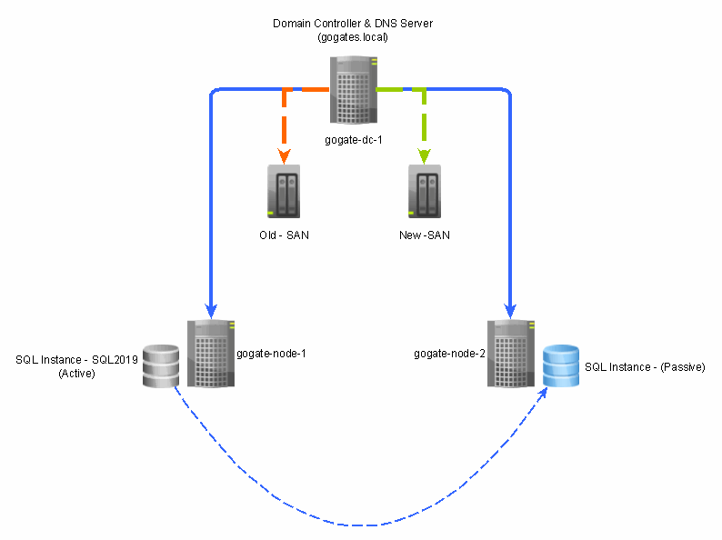

# Replacing-SAN-in-SQL-2019-Cluster
How to replace Storage Area Network (SAN) in SQL 2019 Cluster Environment

## Videos

### SQL-2019 Active - Passive Cluster Environement - With SAN Replacement

# Intruduction
In last few videos we had seen how to confirgure Active - Active SQL 2019 cluster. In this video series, we will see what if we have to replace a [SAN](https://www.snia.org/education/storage_networking_primer/san/what_san) device? Most of the SANs available had to replace in 4-5 years. Since our SQL Cluster is dependant on these SAN devices, if there is a change in SAN storage, there will be a change in SQL Cluster as well.
In this video series, we will see how to analyze and metigate the impact, if we had to replace the SAN device in our data center.

## What's needed to replicate this
#### SQL 2019 & Win 2019 
  - To form Win 2019 Cluster and after that SQL 2019 cluster, you would need corresponding softwares. You can find those details in my prior videos.
#### You would need 3 VMS
  - As shown in Image, 1st VM will act as Domain Controller as well as SAN. Since we can't afford to have a SAN, we have to utilize our VM as SAN.
  - 2 VMs for failover. Note, we have to confirgure Active / Passive SQL 2019 cluster - unlike prior Active / Active cluster

## Creating Shared Disks on Domain Controller
   1. Open Server Manager
   2. Select "File & Storage Services"
   3. Select "iSCSI"
   4. Tasks --> "New iSCSI Virtual Disk"
   5. Specify Disk Name
      - quorum2 (1.5 GB)
      - data02 (5 GB)
      - log02 (4 GB)
   7. Specify Disk Size
   8. Add to an existing iSCSI target if not available new
   9. Repeat process for all 3 drives which needs to be added
